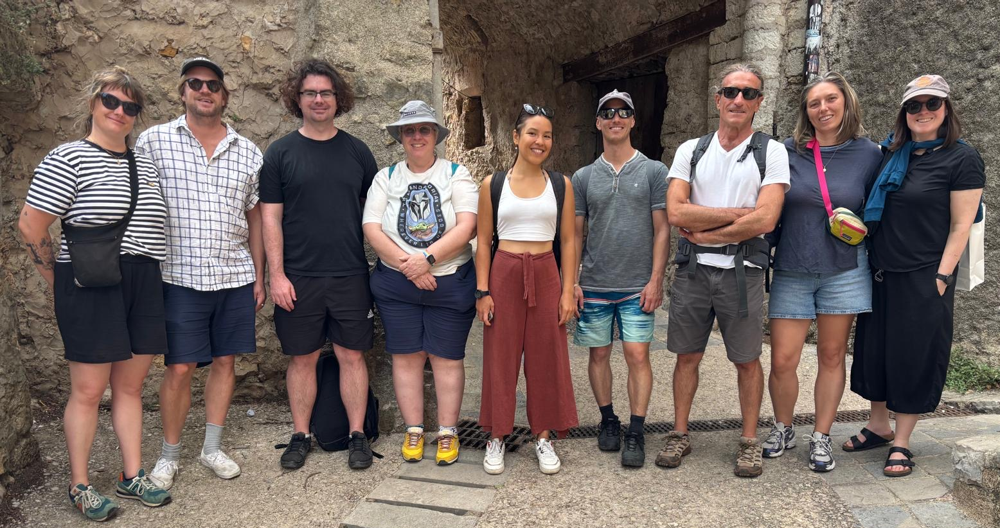

This summer, members of the FishMIP Ocean System Pathways (OSPs) CESAB project gathered at the beautiful CESAB office in Montpellier, southern France, where the high summer temperatures outside (and sometimes inside the meeting rooms!) were matched by the warmth and energy of collaboration. Participants arrived from around the world — Italy, Canada, Australia, France and remotely — to advance our shared mission: developing the OSP scenarios that outline both historical and projected socio-economic conditions for fisheries and aquaculture around the world. 

Together, we explored how FishMIP’s global and regional modeling frameworks can inform pressing questions of food security, equitability, sustainability, and the governance of living marine resources in a global change context. These discussions were framed by an ambitious horizon: contributing to upcoming FAO policy-driven needs for scientific information, as well as upcoming IPBES and IPCC assessment reports.

To keep momentum high throughout the week, Olivier and Tarub made sure the team was well fueled with *pains au chocolat*, croissants, and other addictive French pastries — an essential ingredient for productive scientific debate!

{fig-alt="Day 1 of the workshop" fig-align="center"}

Much of our time was spent grappling with the logistics of a large-scale simulation project: how can the largest possible FishMIP modelling and non-modelling  community be engaged in contributing to and using the OSP scenarios framework, how best to manage data storage, ensure transparent access for both modelers and end-users, and build interfaces that allow results to be shared and explored across communities. These practical questions are as vital as the science itself — helping ensure that our work remains open, usable, and impactful.

Other logistics we grappled with was a team outing to the most beautiful village in France — Saint-Guilhem-le-Désert, a medieval village renowned for its stunning setting and its historic streets. After confusions and disruptions due to country wide protests and labyrinth-like parking garages, we did make it to the village and even to a refreshing swim in the river that winds itself through the hills.

{fig-alt="Exploring the beautiful village of Saint-Guilhem-le-Désert" fig-align="center"}

Another major focus was achieving consensus on methodologies—not only how we model, but why. The group discussed recent advances in bias correction of biogeochemical drivers, including addressing the persistent “cold tongue bias” in the Pacific. These refinements will strengthen the robustness of the inputs used across the impact modeling community.

Finally, we turned to one of the most forward-looking challenges: how to model aquaculture production and its ripple effects on food security and markets at national, sub-regional, and global scales. Understanding these dynamics will be key to projecting sustainable futures for ocean-based food systems.

As the workshop concluded, the sense of shared purpose was palpable. Between coffee breaks, coding sessions, and lively debates, the Montpellier meeting underscored what makes FishMIP unique: a global collaboration united by the goal of translating complex ocean models into knowledge that can guide real-world decisions for a sustainable future.

{fig-alt="Exploring the beautiful village of Saint-Guilhem-le-Désert" fig-align="center"}
