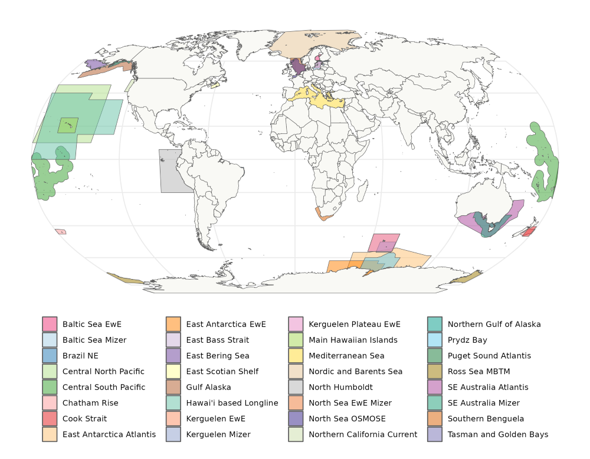

::: {.column-screen style="margin-top: -2.9em;"}
.jpeg){.banner fig-align="center"}
:::

::: {.column-screen .mx-3 .mx-lg-4 .mx-xl-5 .px-3 .px-lg-4 .px-xl-5}
# Modelling Teams

FishMIP simulations would not happen without the contributions of many marine ecosystem modellers working together from different regions of the world.
FishMIP is an open community and continues to grow. Currently our ensemble comprises up to 9 global models and over 30 regional marine ecosystem models. Please refer to our [Protocols](protocols.qmd) to participate in our Simulation Rounds.
For more detailed information on each modelling team's past contributions to ISIMIP simulations and how to cite their outputs please see [here.](https://www.isimip.org/impactmodels/)

## Global Modelling Teams

Our global model ensemble has evolved through time and has supported a wide range of [studies](publications.html), including policy reports on long-term climate impacts for the IPCC 5th and 6th assessments.

**Global Ecosystem Model Coordinators:** Camilla Novaglio & Ryan Heneghan

{target="_blank"}.](../images/tittensoretal2021.png)

Our current global model members are listed below.

| Model | Modellers |
|----|----|
| [APECOSM](https://apecosm.org/){target="_blank"} | Olivier Maury, Nicolas Barrier |
| [BOATS](https://earthsystemdynamics.org/models/boats/){target="_blank"} | Daniele Bianchi, Jerome Guiet, Kim Scherrer |
| [DBEM](https://coru.oceans.ubc.ca/research/){target="_blank"} | William Cheung, Juliano Palacios Abrantes |
| DBPM | Julia Blanchard, Camilla Novaglio, Ryan Heneghan |
| [EcoOcean](https://ecopathinternational.org/ecoocean/){target="_blank"} | Marta Coll, Jeroen Steenbeek, Villy Christensen |
| EcoTroph | Didier Gascuel, Vianney Guibourd de Luzinais |
| FEISTY | Colleen Petrik, Daniël van Denderen, Ken Andersen |
| MACROECOLOGICAL | Ryan Heneghan, Simon Jennnings |
| [ZOOMS](https://github.com/MathMarEcol/ZoopModelSizeSpectra){target="_blank"} | Jason Everett, Anthony Richardson |

## Regional Modelling Teams

We are excited to currently have 34 regional marine ecosystem modelers, who have contributed shapefiles to our map and are planning to contribute to our FishMIP 2.0 simulations. 

**Regional Ecosystem Model Coordinators:** 

* Kelly Ortega (overall lead & Atlantis)
* Marta Coll (EwE)
* Phoebe Woodworth-Jefcoats (mizer)
* Yunne Shin (OSMOSE)

::: {.center}

:::

Not shown in map is KRILLPODYM by David Green and Southern Ocean MICE by Viv Tulloch. We also welcome variants of these or bespoke model types provided they are published and skill assessed. To ensure consistency and standardisation of our simulations please follow our specific regional model implementation guidelines, or contact the relevant coordinators above for any questions.

We are striving towards regional model ensembles - case studies with more than one model per region - to help support regional scale climate risk assessments and fisheries management adaptation plans.

| **Region** | **EwE** | **Mizer** | **Osmose** | **Atlantis** |
|----------------|---------|-----------|------------|--------------|
| North Sea | Chris Lynam | Mike Spence | Morgane Travers | |
| Mediterranean | Marta Coll | | Marta Coll | |
| Southern Benguela | Lynne Shannon | | Ricardo Oliveros-Ramos | Kelly Ortega |
| Peru/Chile | | | Ricardo Oliveros-Ramos | |
| Southeast Australia | Javier Porobic | Camilla Novaglio | | Beth Fulton |
| East Antarctica/ Prydz Bay/ Kerguelen | Roshni Subramaniam, Camila Cataldo Mendez | Kieran Murphy, Romain Forestier | | Ilaria Stollberg , Javier Porobic |
| Chatham Rise | Samik Datta (RPath) | Samik Datta & Alice Rogers | | Vidette McGregor |
| Tasman/Goldern Bays | Samik Datta (RPath) |Samik Datta & Alice Rogers| | Vidette McGregor |
| Bering Sea | Andy Whitehouse (RPath) | Jon Reum |  |  |
| Baltic Sea | Susa Niiranen | Max Lindmark | | |
| Nordic and Barents Sea | | | | Bérengère Husson & Cecelie Hansen |
| Hawai'i based Longline | | Phoebe Woodworth-Jefcoats | | James Ruzicka & Caren Barcelo (ECOTRAN) |
| Eastern Scotian Shelf | | Ezekiel Adekoya | | |
| California Current | Laura Koehn | | | Isaac Kaplan |
| Puget Sound | | | | Hem Morzaria-Luna |
| Cook Strait | Tyler Eddy | | | |
| NE Brazil | Leonardo Capitani | | | |
| Gulf of Alaska | Bia Dias | Cheryl Barnes | | |

:::